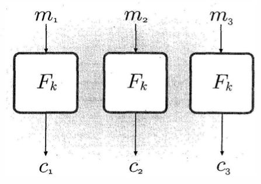

For a very brief theory of "Advanced Encryption Standard" and their analysis, click [here](docs/16_AES.pdf)

For a very brief theory of "Modes of Encryption" and their analysis, click here](docs/Modes-of-operation.pdf)

   Electronic Code Book(ECB) mode

   Cipher Block Chaining(CBC) mode

   Contur mode

   Output FeedBack modes